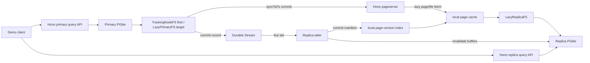

# PGlite Durable VFS and live read replica demo design

## Status

This is a design for a fast, strong demo of a server-side PGlite storage layer
that behaves like a small Neon-style pageserver. The goal is to get to a
compelling live read replica quickly, with almost all code in TypeScript and
Node.

This document assumes implementation inside the PGlite monorepo as a new
package, probably:

```text
packages/pglite-durable-vfs
```

The demo should use published Durable Streams packages, not local workspace
links to the checked-out Durable Streams repository.

Current published versions checked during investigation:

```text
@durable-streams/client  0.2.6
@durable-streams/server  0.3.7
@durable-streams/cli     0.2.6
hono                     4.12.27
@hono/node-server        2.0.6
```

## Executive summary

The fastest path to a strong demo is not real PostgreSQL WAL replay. Instead,
build a page-image timeline:

1. A primary PGlite instance runs on a custom synchronous filesystem.
2. The filesystem records dirty file ranges and metadata operations while
   PostgreSQL runs.
3. At PGlite's `syncToFs()` boundary, after a query has been processed and
   before the result is returned, the filesystem turns those mutations into a
   commit manifest.
4. The manifest points at 8 KiB page images for relation-like files and whole
   file images for small/control files.
5. A Hono pageserver saves those objects to disk.
6. The primary appends a compact commit record to a Durable Stream.
7. A replica tails the Durable Stream, updates its local page-version index,
   invalidates affected PostgreSQL buffers in the running replica, and advances
   its visible LSN.
8. Replica queries run against a lazy local page cache. Missing pages are
   fetched from the pageserver on first use, then served synchronously from the
   local cache.

The first implementation can use `TrackingNodeFS` for the primary to reduce
risk. The architecture target should also support `LazyPrimaryFS`: a primary
compute with the same lazy local page cache as replicas, plus a dirty overlay
and commit publisher.

The live tailing read replica is the demo feature. It can show:

- primary query returns only after the mutation is durable in the pageserver
  and visible in the stream;
- replica tails the stream and catches up live without restarting PGlite;
- replica page cache invalidation is visible: a page read before the commit is
  dropped from PostgreSQL buffers and reloaded at the newer LSN;
- replica cache loading is lazy: changed pages are not fetched during tailing
  unless a query actually needs them;
- replica can be stopped and restarted, then catch up from stream offset;
- pageserver can materialize the database at an older LSN for time travel.



## Goals

- Build a very strong demo quickly.
- Keep the implementation server-side only: Node, TypeScript, Hono.
- Keep almost all code in the TypeScript layer, with only small targeted
  PGlite/Postgres hooks where the VFS boundary is not enough.
- Implement as a package inside the PGlite monorepo.
- Use published Durable Streams packages.
- Store pages and metadata on local disk for the demo.
- Proxy to or start a Node Durable Streams server from the demo server.
- Demonstrate live read replicas tailing a durable commit stream.
- Demonstrate "page at LSN" style reads from a pageserver.
- Demonstrate a running replica whose page cache is invalidated as it tails.
- Demonstrate lazy page loading into the replica's local cache.
- Make the primary capable of the same lazy page-cache model, so a writer can
  start on a fresh machine from a timeline and only load pages it touches.
- Leave room for a future object-storage backend.

## Non-goals for the first demo

- No browser implementation.
- No multi-writer support.
- No true PostgreSQL hot standby.
- No PostgreSQL WAL redo on replicas.
- No production-grade crash recovery in the first pass.
- No object storage dependency in the first pass.
- No broad PostgreSQL fork. The first demo does include minimal PGlite/Postgres
  changes for live buffer/cache invalidation and transaction commit flushing.
- No need to make PGlite read synchronously from HTTP.

## Current PGlite facts that shape the design

### PGlite has the right commit boundary

PGlite already exposes a filesystem hook:

```ts
interface Filesystem {
  syncToFs(relaxedDurability?: boolean): Promise<void>
}
```

The public `query()` and `exec()` implementations batch internal protocol
calls with `syncToFs: false`, then call `syncToFs()` once before returning to
the caller when not inside a JS-managed transaction.

That is the ideal point to publish a commit to the pageserver and Durable
Stream:

- PostgreSQL has already completed the query.
- The synchronous VFS methods have already seen every write/truncate/rename.
- The client has not received success yet.
- We can make remote durability part of the observable query boundary.

### The transaction helper has a caveat

The current TypeScript `transaction()` helper commits while its JS-side
`#inTransaction` flag is still true. That means the `COMMIT` call does not
currently trigger `syncToFs()` through the usual path.

For the demo, patch PGlite TypeScript so a successful transaction `COMMIT` is
followed by `syncToFs()` before `transaction()` resolves. This is a small
PGlite-layer change, but it removes an otherwise surprising footgun from the
demo API.

### PGlite's FS operations are synchronous

`BaseFilesystem` methods such as `read`, `write`, `truncate`, `rename`, and
`lstat` are synchronous. The async point is `syncToFs()`.

That means Node has no built-in synchronous HTTP or `fetch` API for page
faults. A replica cannot simply `await fetch()` inside `read()`.

There are still two workable lazy-loading designs:

1. Fast first demo: run the pageserver and replica in one Node process and let
   `LazyReplicaFS.read()` call a synchronous disk-backed `PageResolver` directly.
   Hono still exposes the HTTP API, but the local replica does not need HTTP for
   page faults.
2. Remote pageserver demo: use a SAB-backed worker fetch bridge. The
   synchronous VFS thread posts a page request into a `SharedArrayBuffer`,
   blocks with `Atomics.wait`, and a worker performs async HTTP fetch, writes
   bytes into the local cache and directly into WASM memory, then wakes the VFS
   thread.

The first path is much faster to build and is strong enough for the live demo.
The second path proves the same API works when the pageserver is not in
process.

The important invariant is that PGlite still only reads local bytes
synchronously. Network IO is hidden behind cache fill before the VFS returns
from `read()`.

### SAB-backed WASM memory for async page loading

This is probably the right deeper solution for remote lazy pages.

The current PGlite TypeScript creates/imports a normal `WebAssembly.Memory`:

```ts
const wasmMemory = new WebAssembly.Memory({
  initial,
  maximum: 32768,
})
```

The current PostgreSQL/PGlite build also uses `-sUSE_PTHREADS=0`. That means we
should not assume we can simply pass `{ shared: true }` at runtime and be done.
WASM shared memory is part of the module's memory type. A shared-memory build
variant must be produced deliberately.

Target build shape:

```ts
const wasmMemory = new WebAssembly.Memory({
  initial,
  maximum,
  shared: true,
})
```

And a matching PGlite/Postgres build variant that:

- imports shared memory;
- enables the required wasm atomics/shared-memory features;
- keeps a fixed or carefully managed maximum memory;
- is server-side Node first, so we do not need browser COOP/COEP headers for
  this demo path.

For the first SAB prototype, prefer fixed-size memory over memory growth. If
WASM memory grows while a worker is holding an old `SharedArrayBuffer` view,
the bridge becomes much harder to reason about. A fixed `initial == maximum`
server build is a reasonable demo tradeoff.

Do not silently inherit today's browser-oriented memory defaults for this build.
The SAB artifact needs an explicit Node demo memory budget:

- too small, and the demo fails with ordinary PostgreSQL OOM behavior;
- too large, and each compute worker reserves an unacceptably large shared heap;
- if the first artifact uses fixed memory, document the configured heap size and
  expose a clear startup error when the requested size is outside the supported
  range.

The bridge should run PGlite itself inside a Node `Worker`, not on the Hono
event-loop thread. `Atomics.wait` is the right primitive for making a
synchronous VFS call wait for async IO, but blocking the HTTP server's main
event loop would be a bad demo server shape.

Proposed request flow:

```text
PGlite compute worker
  LazyReplicaFS.read(fd, HEAP8, offset, length, position)
    -> classify path/page
    -> if cache hit, copy local bytes into HEAP8 and return
    -> if cache miss, write request descriptor to control SAB
    -> include wasm write pointer = offset and byteLength = length
    -> Atomics.notify(fetch worker)
    -> Atomics.wait(control, status, PENDING)

Fetch worker
  -> read request descriptor
  -> fetch page/file bytes from pageserver over HTTP
  -> validate object hash/length/LSN
  -> write bytes directly into shared WASM memory at pointer
  -> optionally persist bytes into local page cache
  -> publish result code / bytesRead
  -> Atomics.notify(compute worker)

PGlite compute worker
  -> wake
  -> return bytesRead to Emscripten FS
```

This is not true kernel zero-copy from the socket into WASM memory. Node/fetch
will still produce bytes in JS/V8-managed buffers. But it avoids the worst
extra copies:

- no copy from fetch worker to compute worker;
- no copy through a process boundary;
- no `curl`/`execFileSync`;
- no second copy from local cache into WASM on the cache-miss path if the worker
  writes the fetched page directly into the read buffer.

Important constraints:

- the fetch worker must only write to the exact requested output range in WASM
  memory;
- the compute worker must not continue until the fetch worker has published a
  result with `Atomics.store`/`Atomics.notify`;
- no code should call into the PGlite `Module` concurrently from the fetch
  worker;
- the page resolver must verify content hashes before waking success;
- EOF, truncation, and missing-page cases must map cleanly to the synchronous
  `read()` return value or errno;
- if memory growth is enabled later, the bridge needs a memory-generation check
  and workers must refresh their views.

This SAB worker bridge should be shared by `LazyReplicaFS` and `LazyPrimaryFS`.
The primary uses the same cache-miss path for clean pages, then layers dirty
overlay semantics on top.

### PGlite start parameters are friendly to the demo

PGlite starts PostgreSQL in single-user mode and includes:

```text
--single
-F
io_method=sync
max_worker_processes=0
```

This is useful for the demo:

- There is one active compute process per PGlite instance.
- VFS write tracking is not fighting background workers.
- The TypeScript `syncToFs()` hook is the durability boundary.

### PostgreSQL already exposes WAL LSN functions

The embedded PostgreSQL catalog includes:

- `pg_current_wal_lsn()`
- `pg_current_wal_insert_lsn()`
- `pg_current_wal_flush_lsn()`
- `pg_wal_lsn_diff()`

PGlite also has a `pg_walinspect` extension test that calls
`pg_current_wal_lsn()`.

However, the filesystem hook itself cannot safely call `db.query()` to fetch
the current WAL LSN, because it is already running under the database query and
filesystem sync path.

For the first demo, use a VFS timeline LSN. Later, expose a synchronous
WASM-exported getter for the current PostgreSQL WAL insert/write LSN if we
want the displayed LSN to be a real PostgreSQL LSN.

## Design choice: page-image timeline instead of WAL replay

There are three broad approaches:

1. Store whole PGDATA snapshots per commit.
2. Store PostgreSQL WAL and replay it in replicas.
3. Store changed page/file images per commit.

The demo should choose option 3.

Whole PGDATA snapshots are simple but not impressive enough and become slow
quickly.

Real WAL replay is architecturally elegant, but it pulls us into PostgreSQL
storage/recovery semantics, buffer cache invalidation, timelines, recovery
state, and probably Postgres changes. It is the wrong first milestone.

Page-image commits give the right demo shape:

- pageserver returns pages/files as of a specific LSN;
- replicas tail a durable stream;
- time travel is natural;
- almost all code stays in TypeScript, with one small native invalidation hook
  for the running replica;
- no synchronous HTTP is needed inside PGlite;
- the system looks and feels like a simplified Neon architecture.

For demo language, we can describe the Durable Stream as the replica's WAL-like
commit log. Internally it is not PostgreSQL WAL redo. It is an ordered stream of
page-image commits with enough invalidation metadata for a running replica to
advance safely.

## Mental model

This is not "PGlite reads every page from HTTP". It is:

```text
Primary compute:
  first milestone:
    PGlite -> local TrackingNodeFS -> commit page images to pageserver

  architecture target:
    PGlite -> LazyPrimaryFS -> local cache, lazy fetch on miss
    LazyPrimaryFS -> dirty overlay -> syncToFs publishes page images

Durability and ordering:
  Durable Stream contains commit manifests in order

Replica compute:
  tail stream -> update page-version index -> invalidate running PGlite buffers
  PGlite -> LazyReplicaFS -> local cache, with lazy page fetch on miss
```

The pageserver is the source of truth for historical page/file state. The
Durable Stream is the ordered control plane that tells replicas what commits
exist, which cached pages are stale, and where to fetch their replacement
objects.

## Package layout

Proposed layout:

```text
packages/pglite-durable-vfs/
  package.json
  tsconfig.json
  tsup.config.ts
  src/
    index.ts
    fs/
      tracking-node-fs.ts
      dirty-tracker.ts
      path-classifier.ts
      node-sync-ops.ts
    pageserver/
      app.ts
      disk-store.ts
      object-store.ts
      commit-store.ts
      page-resolver.ts
      routes.ts
    durable/
      timeline-stream.ts
      durable-server.ts
      stream-proxy.ts
    primary/
      create-primary.ts
      durable-pglite.ts
      lazy-primary-fs.ts
      primary-page-cache.ts
      query-api.ts
    replica/
      lazy-replica-fs.ts
      page-cache.ts
      page-version-index.ts
      invalidation.ts
      sync-page-resolver.ts
      sab-page-resolver.ts
      sab-fetch-worker.ts
      replica-pglite.ts
      tailer.ts
      materializer.ts
    compute/
      pglite-compute-worker.ts
      shared-wasm-memory.ts
      sab-control-block.ts
    demo/
      server.ts
      scenario.ts
      seed.ts
    shared/
      lsn.ts
      hash.ts
      types.ts
      errors.ts
  tests/
    dirty-tracker.test.ts
    disk-store.test.ts
    lazy-primary-fs.test.ts
    lazy-replica-fs.test.ts
    integration.test.ts
```

Exports:

```ts
export { TrackingNodeFS } from "./fs/tracking-node-fs.js"
export { createPageServer } from "./pageserver/app.js"
export { createDurablePrimary } from "./primary/create-primary.js"
export { createDurableReplica } from "./replica/replica-pglite.js"
export { LazyPrimaryFS } from "./primary/lazy-primary-fs.js"
export { LazyReplicaFS } from "./replica/lazy-replica-fs.js"
export type {
  CommitManifest,
  CommitLsn,
  TimelineId,
  PageKey,
  InvalidationEntry,
  DurableVfsOptions,
} from "./shared/types.js"
```

Package dependencies:

```json
{
  "dependencies": {
    "@durable-streams/client": "^0.2.6",
    "@durable-streams/server": "^0.3.7",
    "@hono/node-server": "^2.0.6",
    "hono": "^4.12.27"
  },
  "peerDependencies": {
    "@electric-sql/pglite": "workspace:*"
  },
  "devDependencies": {
    "@electric-sql/pglite": "workspace:*",
    "@types/node": "^20.16.11",
    "tsx": "^4.19.2",
    "tsup": "^8.3.0",
    "vitest": "^2.1.2"
  }
}
```

## Main components

### 1. TrackingNodeFS

`TrackingNodeFS` is a custom `BaseFilesystem` implementation backed by Node's
synchronous fs APIs.

It should not extend PGlite's `NodeFS`, because `NodeFS` mounts Emscripten's
built-in `NODEFS` directly and does not expose per-operation hooks. We need a
custom `BaseFilesystem` implementation so every file operation is visible.

Responsibilities:

- implement the full synchronous `BaseFilesystem` API over Node:
  - `open`
  - `close`
  - `read`
  - `write`
  - `writeFile`
  - `truncate`
  - `rename`
  - `unlink`
  - `mkdir`
  - `rmdir`
  - `readdir`
  - `lstat`
  - `fstat`
  - `chmod`
  - `utimes`
- keep fd to path mappings;
- map PGlite paths under the mounted PGDATA root to a real disk root;
- record dirty page ranges for relation-like files;
- record whole-file dirtiness for control/small files;
- record metadata operations in order;
- implement `syncToFs()` as the remote commit boundary.

Important path detail: PGlite custom filesystem paths are PGDATA-relative paths
that usually begin with `/`, for example:

```text
/PG_VERSION
/base/5/16384
/global/pg_control
/pg_wal/000000010000000000000001
```

#### File classification

The tracker should classify paths into categories:

```ts
type FileClass =
  | "relation"
  | "relation_aux"
  | "wal"
  | "control"
  | "small"
  | "temporary"
  | "directory"
  | "unknown"
```

Relation-like files:

```text
/base/<dbOid>/<relfilenode>
/base/<dbOid>/<relfilenode>.<segment>
/base/<dbOid>/<relfilenode>_fsm
/base/<dbOid>/<relfilenode>_vm
/base/<dbOid>/<relfilenode>_init
/global/<relfilenode>
/global/<relfilenode>.<segment>
/pg_tblspc/.../<dbOid>/<relfilenode>
```

For relation-like files, track changed 8 KiB pages.

For everything else that matters to opening PostgreSQL safely, store whole-file
images after mutation. This includes:

```text
/PG_VERSION
/postgresql.conf
/global/pg_control
/global/pg_filenode.map
/global/pg_internal.init
/pg_xact/*
/pg_multixact/*
/pg_subtrans/*
/pg_wal/*
```

For a first demo, it is acceptable to store all non-relation mutated files as
whole-file images. This is less efficient but much safer and faster to build.

Temporary files can be excluded:

```text
*/pgsql_tmp/*
```

The exclusion must be conservative. If a file is required for lazy replica
metadata, page lookup, or time-travel materialization, include it.

#### Dirty page tracking

PostgreSQL pages are normally 8 KiB (`BLCKSZ`). The tracker should use 8192 as
the page size for the demo.

When `write(path, position, length)` occurs on a relation-like file:

```ts
const firstPage = Math.floor(position / 8192)
const lastPage = Math.floor((position + length - 1) / 8192)
```

Mark every touched page dirty. On `syncToFs()`, read the final 8 KiB page image
from local disk and publish that image. Do not try to publish the write buffer
directly, because a page may receive multiple writes during a query.

If the final page is shorter than 8192 because the file is truncated or is a
partial segment end, store the actual bytes and the file size in the manifest.

#### Metadata operation tracking

The tracker must preserve operations that change the file tree:

```ts
type MetadataOperation =
  | { type: "mkdir"; path: string; mode?: number }
  | { type: "rmdir"; path: string }
  | { type: "unlink"; path: string }
  | { type: "rename"; from: string; to: string }
  | { type: "truncate"; path: string; size: number }
  | { type: "chmod"; path: string; mode: number }
  | { type: "utimes"; path: string; atime: number; mtime: number }
```

The primary manifest writer records metadata operations before final file/page
objects. Replica tailers apply those metadata changes to their local metadata
indexes before advancing `appliedLsn`. Exact ordering matters around
rename/truncate/unlink.

For the first demo, a simpler safe rule is:

- record metadata operations in order;
- after applying metadata, write final images for all dirty pages/files.

#### Buffer normalization

The existing `BaseFilesystem` bridge passes data in a way that may be an
`ArrayBuffer` or a `Uint8Array` depending on the path through Emscripten. The
Node implementation should normalize before using `fs.writeSync`:

```ts
function bufferView(
  buffer: Uint8Array | ArrayBuffer,
  offset: number,
  length: number,
): Uint8Array {
  if (buffer instanceof Uint8Array) {
    return buffer.subarray(offset, offset + length)
  }
  return new Uint8Array(buffer, offset, length)
}
```

### 2. LazyPrimaryFS

`LazyPrimaryFS` is the architecture target for the primary/master compute. It
uses the same lazy local page-cache model as `LazyReplicaFS`, but adds a dirty
overlay and a commit publisher.

This makes the writer side look like Neon compute:

```text
Primary PGlite
  -> LazyPrimaryFS
     -> dirty overlay for pages/files changed by local writes
     -> clean page cache for fetched pages/files
     -> pageserver lookup for cache misses
     -> syncToFs publishes final dirty images
```

Responsibilities:

- implement the synchronous `BaseFilesystem` API;
- on `read()`, prefer local dirty bytes, then clean cache, then pageserver
  lookup through `SyncPageResolver`;
- on `write()` / `truncate()` / metadata mutation, update local cache or dirty
  overlay immediately and record dirty page/file/metadata entries;
- never refetch a page from the pageserver once that page is dirty locally;
- on `syncToFs()`, read final dirty page/file images from the overlay/cache,
  publish them to the pageserver, append the Durable Stream commit event, and
  only then resolve the primary query;
- keep a pending commit journal so crash recovery can retry or discard
  uncommitted local dirty state safely.

Primary reads do not need the native buffer invalidation hook for their own
writes. PostgreSQL made those writes itself, so its buffers are already
coherent. The hook is needed on replicas because their underlying page versions
change externally while PostgreSQL is still running.

The first demo may still start with `TrackingNodeFS` for the primary. That is
the lower-risk path because all primary reads and writes are local filesystem
operations and only `syncToFs()` talks to the pageserver. `LazyPrimaryFS` should
be in the plan as the next target, because it enables a primary to start on a
fresh machine with only:

- timeline ID;
- pageserver URL;
- stream URL;
- base snapshot or latest LSN.

#### Primary dirty overlay

For relation-like files, the primary overlay stores dirty 8 KiB pages keyed by
`(path, pageNo)`. For non-relation files, it stores whole-file images or final
bytes after metadata operations.

Read order:

```text
dirty overlay -> clean local cache -> synchronous pageserver resolver
```

Write order:

```text
PostgreSQL write -> dirty overlay/cache update -> dirty tracker entry
```

Commit order is the same as `TrackingNodeFS`:

```text
objects -> manifest -> Durable Stream event -> local completed journal
```

#### Primary lease

The demo can assume a single writer. The architecture should nevertheless name
the missing production guard: a timeline write lease.

For the demo:

```text
one process owns timelineId="demo" as primary
```

Later:

```text
POST /v1/timelines/:timelineId/lease
renew lease while primary is alive
reject syncToFs publish if lease is missing or expired
```

### 3. PageServer

The pageserver is a Hono app backed by local disk.

Responsibilities:

- own timelines;
- store commit manifests;
- store object blobs;
- answer "page/file as of LSN";
- expose materialization helpers;
- proxy Durable Streams requests or start a local Durable Streams server for
  the demo.

The first implementation can run in the same Node process as the demo primary
and replica.

#### Disk layout

Proposed disk layout:

```text
.pglite-durable-vfs/
  pageserver/
    timelines/
      <timelineId>/
        timeline.json
        head.json
        staging/
          <commitId>/
            commit.json
            page-index-delta.jsonl
            file-index-delta.jsonl
        commits/
          <lsn>.json
        page-index/
          <encoded-page-key>.jsonl
        file-index/
          <encoded-path>.jsonl
        objects/
          sha256/
            ab/
              cdef...
        snapshots/
          base/
            manifest.json
            files/
              ...
  streams/
    ...
  primary/
    pgdata/
  replicas/
    <replicaId>/
      cache/
        files/
          <encoded-path>/
            current
        pages/
          <encoded-page-key>
      indexes/
        page-versions.jsonl
        file-versions.jsonl
      state.json
  materializations/
    <timelineId>/
      <lsn>/
        pgdata/
```

Object blobs are content-addressed by SHA-256. This makes retries and duplicate
page images cheap:

```text
objects/sha256/<first-two-hex>/<full-hash>
```

Indexes are append-only JSONL for the first demo:

```json
{"lsn":"0/00000010","path":"/base/5/16384","pageNo":0,"sha256":"...","size":8192}
{"lsn":"0/00000020","path":"/base/5/16384","pageNo":0,"sha256":"...","size":8192}
```

For the demo, JSONL plus an in-memory cache is enough. A later version can
replace this with SQLite, LMDB, or object storage plus compacted index layers.

#### Commit atomicity

The pageserver must expose each commit atomically. A replica that sees a Durable
Stream event must be able to fetch the referenced manifest and every referenced
object, and page/file lookup at that LSN must be recoverable after a crash.

Use this local-disk protocol for the first implementation:

1. Validate idempotency and ordering:
   - if `commits/<lsn>.json` already exists with the same `commitId` and
     manifest hash, return success;
   - if the same LSN exists with different content, return `409`;
   - otherwise `previousLsn` must match `head.json`;
   - object hashes, byte lengths, and page/file metadata must match the manifest.
2. Write missing content-addressed objects through temp files and atomic rename.
3. Write the incoming manifest and index deltas under
   `staging/<commitId>/`.
4. Promote the manifest with an atomic rename to `commits/<lsn>.json`.
5. Append or install the page/file index deltas.
6. Atomically replace `head.json`.
7. Remove the staging directory only after the commit is fully visible.

`commits/<lsn>.json` is the source of truth. If the process crashes after the
manifest promotion but before index append or `head.json` replacement, startup
must rebuild the in-memory/index JSONL state from commit manifests and finish or
roll forward the staged commit. This keeps the demo simple without pretending
JSONL appends are a transactional database.

#### Hono API

The internal pageserver API should be explicit and easy to debug.

```text
GET  /health

POST /v1/timelines
GET  /v1/timelines/:timelineId
GET  /v1/timelines/:timelineId/head

POST /v1/timelines/:timelineId/base-snapshot
GET  /v1/timelines/:timelineId/base-snapshot

POST /v1/timelines/:timelineId/commits
GET  /v1/timelines/:timelineId/commits/:lsn
GET  /v1/timelines/:timelineId/commits?after=:lsn

GET  /v1/timelines/:timelineId/stat/*?lsn=:lsn
GET  /v1/timelines/:timelineId/readdir/*?lsn=:lsn
GET  /v1/timelines/:timelineId/pages/*?lsn=:lsn&pageNo=:pageNo
GET  /v1/timelines/:timelineId/files/*?lsn=:lsn
GET  /v1/timelines/:timelineId/objects/:sha256

POST /v1/timelines/:timelineId/materialize
GET  /v1/timelines/:timelineId/materializations/:jobId

ANY  /streams/*
```

The `/streams/*` route proxies to a Node Durable Streams server in the demo.
The demo can either:

1. start `DurableStreamTestServer` from `@durable-streams/server`; or
2. require the user to start the Durable Streams server separately and pass its
   base URL.

Starting it inside the demo is better for "one command" usage.

### 4. DurableTimeline

The Durable Stream is the ordered replication log.

It should use Durable Streams' JSON mode. Do not roll a JSONL framing protocol
over binary stream entries for commit events.

It should not store all page bytes. It stores a compact JSON commit event with:

- timeline ID;
- LSN;
- previous LSN;
- commit manifest URL or embedded manifest summary;
- counts and hashes for observability.

The pageserver must complete its atomic commit protocol before the commit event
is appended to the Durable Stream.

This ordering is important:

```text
1. save objects
2. promote commit manifest and index deltas
3. replace pageserver head
4. append commit event to stream
5. flush producer
6. return query result to client
```

If the stream event is visible, replicas must be able to fetch the manifest and
objects it references.

Use `IdempotentProducer` from `@durable-streams/client` for exactly-once-ish
append behavior in the face of retries.

Persist the producer identity and sequence/claim state in the primary pending
commit journal before the first append attempt. Retrying after a process crash
must use the same commit ID and producer sequence information, otherwise a retry
can produce a duplicate stream event even if the pageserver commit is
idempotent.

Create each timeline stream with `contentType: "application/json"`, append
`CommitEvent` objects through `IdempotentProducer`, and tail them with
`json: true`:

```ts
const stream = await DurableStream.create({
  url: streamUrl,
  contentType: "application/json",
})

const producer = new IdempotentProducer(stream, `pglite-${timelineId}`, {
  autoClaim: true,
})

producer.append(commitEvent)
await producer.flush()
```

For live tailing, use:

```ts
const stream = new DurableStream({ url })
const response = await stream.stream<CommitEvent>({
  offset: savedOffset,
  live: true,
  json: true,
})

response.subscribeJson(async (batch) => {
  for (const commit of batch.items) {
    await replica.applyCommit(commit)
  }
})
```

The tailer stores the Durable Streams offset after applying each commit, so a
replica restart resumes from the correct point.

JSONL is still fine for local disk indexes such as `page-index/*.jsonl` and
`page-versions.jsonl`; those are append-only files in the pageserver/replica
cache, not the Durable Streams transport format.

### 5. Primary API

The primary package API should make the demo easy without wrapping the PGlite
query surface. `createDurablePrimary()` returns a real `PGlite` instance with a
small `.durable` control plane attached. Code that spies on or extends a PGlite
instance should continue to see normal `query`, `exec`, `transaction`, and
extension methods.

```ts
const primary = await createDurablePrimary({
  dataDir: "./.pglite-durable-vfs/primary/pgdata",
  timelineId: "demo",
  pageServerUrl: "http://127.0.0.1:7345",
  streamUrl: "http://127.0.0.1:7345/streams/demo",
  fsMode: "tracking", // later: "lazy"
})

const result = await primary.query(
  "insert into events (body) values ($1) returning *",
  ["hello"],
)

console.log(result.rows)
console.log(primary.durable.lastCommit?.lsn)
```

The HTTP API can adapt the normal PGlite result into `{ result, commit }`
responses by checking the durable commit serial before and after the query:

```ts
const before = primary.durable.commitSerial
const result = await primary.query(sql, params)
const commit = primary.durable.commitAfter(before)
```

The durable control plane exposes status and commit metadata:

```ts
interface CommitSummary {
  timelineId: string
  lsn: string
  previousLsn?: string
  durableOffset?: string
  pageCount: number
  fileCount: number
  byteCount: number
}
```

The implementation is VFS-first. PGlite exposes a filesystem query hook, and
the durable primary installs an `aroundQuery` hook after PGlite startup. The
hook defers filesystem publication while a public query or transaction runs,
runs `CHECKPOINT` after successful mutations, then flushes the commit before the
PGlite call resolves. The startup delay matters because PGlite internal init
queries should not be published as user commits.

```ts
const fs =
  fsMode === "lazy"
    ? new LazyPrimaryFS(dataDir, replicationOptions)
    : new TrackingNodeFS(dataDir, replicationOptions)
const db = new PGlite({ fs })
attachDurablePrimary(db, durablePrimaryController)
```

The filesystem remembers the last commit summary so callers can inspect it
through `db.durable.lastCommit` or derive per-query commit metadata using
`commitAfter()`.

For the first demo, default `fsMode` to `"tracking"`. The API should reserve
`"lazy"` from the start so the primary can later use the same on-demand
pageserver-backed cache model as replicas.

For the demo Hono API:

```text
POST /v1/primary/query
POST /v1/primary/exec
GET  /v1/primary/status
```

Payload:

```json
{
  "sql": "select count(*) from events",
  "params": []
}
```

Response:

```json
{
  "result": {
    "rows": [{"count":"42"}],
    "fields": [{"name":"count","dataTypeID":20}]
  },
  "commit": {
    "timelineId": "demo",
    "lsn": "0/0000002A",
    "pageCount": 3,
    "fileCount": 1
  }
}
```

### 6. LazyReplicaFS and live invalidation

The replica should be a running PGlite instance backed by a custom
`LazyReplicaFS`, not a PGlite instance that is restarted for every new LSN.

The tailer does not eagerly fetch changed page bytes. It only fetches commit
manifests, updates the local page-version index, invalidates stale cached data,
and tells the running PGlite instance to drop affected buffers.

Replica state:

```text
replicas/<id>/
  cache/
    pages/<encoded-page-key>
    files/<encoded-path>/current
  indexes/
    page-versions.jsonl
    file-versions.jsonl
  apply/
    <lsn>.json
  state.json
```

`state.json` contains:

```ts
interface ReplicaState {
  replicaId: string
  timelineId: string
  appliedLsn: string
  streamOffset?: string
  baseSnapshotId: string
  readOnly: true
}
```

Replica bootstrap:

1. Initialize the primary and run setup DDL.
2. Publish a base snapshot manifest from the primary PGDATA directory.
3. Start the replica with `LazyReplicaFS` using that base snapshot as LSN `0`.
4. Open PGlite with `noInitDb: true` on the lazy filesystem.
5. Start tailing commits after the base snapshot LSN.

For the first demo, keep schema creation in this setup phase and make the live
tailing moment DML-only. DDL can be supported by the same manifest machinery,
but it needs broader relcache/syscache invalidation and is not required for the
core party piece.

#### Lazy read path

`LazyReplicaFS` implements `BaseFilesystem` and serves PGlite synchronously:

- `lstat()` and `readdir()` read local metadata indexes at `appliedLsn`;
- `open()` records the path for the fd;
- `read()` maps `(path, position, length)` to either whole-file bytes or 8 KiB
  relation page keys;
- if the requested bytes are already in the local cache, it returns them
  immediately;
- on a cache miss, it synchronously asks a `SyncPageResolver` to populate the
  local cache, then reads from the cache;
- durable writes are rejected on replicas, except for explicitly local-only
  paths.

#### Replica write policy

The replica is read-only for durable timeline state, but PostgreSQL may still
write process-local files while opening or serving read queries. Treat these as
an overlay that is never published back to the pageserver:

- temp files and temp directories, for example `pgsql_tmp`;
- transient pid, lock, stats, and session files if this PGlite build creates
  them;
- generated relcache init files such as `pg_internal.init`, which can be deleted
  and regenerated after broad cache invalidation.

Reject writes to relation files, catalog files, `pg_wal`, `global/pg_control`,
timeline manifests, and any unknown path until it has been classified. The first
implementation should run PGlite startup/query smoke tests with write tracing
enabled and turn the observed local-only paths into an explicit allowlist. This
is a demo-critical test: a lazy replica that cannot boot read-only is not useful.

For the first demo, `SyncPageResolver` should use the in-process pageserver
disk store:

```ts
interface SyncPageResolver {
  ensurePage(path: string, pageNo: number, lsn: string): void
  ensureFile(path: string, lsn: string): void
  stat(path: string, lsn: string): FsStats
  readdir(path: string, lsn: string): string[]
}
```

This is still architecturally the pageserver API. It just avoids HTTP for the
local one-command demo. The remote resolver should use the SAB-backed WASM
memory bridge described earlier: the compute worker blocks in `Atomics.wait`,
the fetch worker retrieves bytes over HTTP, validates them, writes directly into
the shared WASM read buffer, then wakes the compute worker.

Do not use `child_process.execFileSync("curl", ...)` for the demo path. It is
slow, hard to make portable, and turns page faults into process-spawn latency.

#### Local page-version index

The replica maintains version indexes without necessarily fetching bytes:

```ts
interface PageVersion {
  timelineId: string
  lsn: string
  path: string
  pageNo: number
  sha256: string
  byteLength: number
  fileSize: number
}

interface FileVersion {
  timelineId: string
  lsn: string
  path: string
  sha256: string
  byteLength: number
  fileSize: number
}
```

On tailing a commit, the replica appends the new versions to these indexes and
evicts any local cached object for the affected keys. It does not fetch the new
object until a query reads that page or file.

#### Buffer invalidation

This part cannot be done correctly in the VFS layer alone.

Once PostgreSQL has read a relation page, later reads may be served from
PostgreSQL's buffer manager without calling `LazyReplicaFS.read()` again. If the
tailer only changes files or VFS metadata, a running replica can return stale
rows forever.

The minimal native change is a small PGlite/Postgres export, called through the
PGlite TypeScript API under the query mutex:

```ts
await replica.invalidateRemotePages({
  lsn,
  relationRanges,
  invalidateSystemCaches,
  invalidateSmgr,
})
```

Suggested native shape:

```c
typedef struct PgliteInvalidateRange
{
  Oid spcOid;
  Oid dbOid;
  RelFileNumber relNumber;
  ForkNumber forkNum;
  BlockNumber firstBlock;
  BlockNumber blockCount; /* 0 can mean through end of fork */
  bool relationSizeChanged;
} PgliteInvalidateRange;

int EMSCRIPTEN_KEEPALIVE
pgl_invalidate_remote_pages(uintptr_t ranges_ptr,
                            int ranges_len,
                            bool invalidate_system_caches,
                            bool invalidate_smgr);
```

Implementation options:

1. Correct and coarse: group changed pages by relation/fork and call
   `DropRelationBuffers()` starting at the lowest changed block. This may drop
   more buffers than necessary but guarantees stale changed pages are gone.
2. Correct and tighter: add a PGlite-specific buffer scan based on Postgres'
   `FindAndDropRelationBuffers()` pattern and invalidate only listed block
   ranges.

The demo should start with option 1. It is good enough for the party piece:
the replica keeps running, tailing invalidates the old page, and the next query
reloads the new page lazily from the page cache.

For any relation extension or truncation, the native hook should also close/drop
the affected smgr state so later scans observe the new file size through
`LazyReplicaFS`. This matters even for a simple insert demo if the insert extends
the heap or an index.

For catalog-heavy commits, set `invalidateSystemCaches = true` and call
Postgres' broad cache invalidation helpers such as `InvalidateSystemCaches()`,
`RelationCacheInvalidate(false)`, and `RelationMapInvalidateAll()` from the
native hook. For the first demo, keep schema changes in the setup phase and
show live replication with DML; then the required invalidation is mostly
relation page buffers.

#### Other replica state to invalidate

For the DML-only party piece, dropping affected relation buffers is the main
correctness requirement, with one extra requirement for relation extension or
truncation: close/drop affected smgr state so PostgreSQL observes the new file
size. Once a page has been evicted from PostgreSQL's buffer manager, the next
access comes back through `LazyReplicaFS` and can fetch the page version for the
new `appliedLsn`.

The general case needs more than page-buffer invalidation:

- relation extension and truncation require updated VFS file-size metadata and
  buffer invalidation from the changed block through end-of-fork when needed;
- relation unlink, rename, or rewrite should close/drop affected smgr state, not
  only page buffers;
- changes to `pg_class`, `pg_attribute`, indexes, constraints, types, schemas,
  or relation mapping require broad relcache/syscache/catcache invalidation;
- relmapper changes require `RelationMapInvalidateAll()`;
- generated relcache init files in the replica-local overlay should be removed
  after broad cache invalidation so they cannot seed stale metadata on restart;
- prepared-plan or statement caches, if exposed by PGlite above Postgres, must be
  cleared when catalog invalidation is requested.

The first demo should avoid live DDL and relation rewrites. It should still
classify these operations in manifests as `metadata` or `system-cache` so the
tailer can conservatively block, broadly invalidate, or fail with a clear
"unsupported live DDL" error instead of serving stale state.

#### Restart fallback for broad changes

The cheap solution for broad catalog, DDL, relation-rewrite, relmapper, or
unknown metadata changes is to restart the replica rather than prove every
Postgres cache has been invalidated correctly.

This should not be the path for normal DML commits, because the live
buffer-invalidation path is the demo's key trick. But for commits marked
`replicaApplyMode: "restart-replica"`, the tailer can:

1. keep reading Durable Stream events and record the pending apply journal;
2. stop accepting new replica queries;
3. wait for any active query or explicit transaction to finish;
4. close the current PGlite instance;
5. apply local version-index and metadata changes for the target LSN;
6. reopen PGlite with `noInitDb: true` on the same `LazyReplicaFS`;
7. only then persist the new `appliedLsn` and stream offset.

Restarting clears PostgreSQL buffer manager state, smgr state, relcache,
syscache, catcache, relmapper state, generated relcache init state, and any
PGlite-level prepared statement cache tied to the old instance. That makes it a
good conservative fallback for the demo.

Do not restart underneath an active query or transaction unless the API has
explicitly chosen to abort it. The default should be to let the query or
transaction finish at its old `appliedLsn`, then restart and advance.

#### Query and transaction sequencing

The replica tailer must not advance the visible `appliedLsn` while a query or
explicit transaction is running. A long read transaction pins the replica at its
starting LSN; the tailer may keep reading Durable Stream events into an
in-memory backlog, but it must wait to update local version indexes, evict page
cache entries, call native invalidation, or restart the replica until the
transaction ends.

This gives a simple rule:

```text
each replica query/transaction observes exactly one appliedLsn
```

For the first demo, use the PGlite query mutex as the serialization point. If
the demo exposes explicit multi-query transactions on replicas, hold the same
replica apply lock for the full transaction, not just for each individual query.

#### Path to invalidation mapping

The manifest should include invalidation entries derived from file paths:

```ts
interface InvalidationEntry {
  kind: "relation-range" | "whole-file" | "metadata" | "system-cache"
  path: string
  spcOid?: number
  dbOid?: number
  relNumber?: number
  fork?: "main" | "fsm" | "vm" | "init"
  firstBlock?: number
  blockCount?: number
  relationSizeChanged?: boolean
}
```

Mapping rules:

- `/base/<dbOid>/<relfilenode>` maps to tablespace `1663`, that `dbOid`, main
  fork;
- `/base/<dbOid>/<relfilenode>.<segment>` maps to the same relation, with
  `firstBlock += segment * RELSEG_SIZE`;
- `/base/<dbOid>/<relfilenode>_fsm`, `_vm`, `_init` map to the corresponding
  fork;
- `/global/<relfilenode>` maps to tablespace `1664`, database `0`;
- `/pg_tblspc/<spcOid>/<version>/<dbOid>/<relfilenode>` maps to that
  tablespace and database.

For normal PostgreSQL builds, `RELSEG_SIZE` is `131072` 8 KiB pages. The code
should keep this as an explicit constant and later expose it from the WASM
build if PGlite ever builds with a different segment size.

Mapping caveats:

- mapped relations do not have a stable normal relfilenode in `pg_class`; changes
  involving relation mapping must emit `system-cache` and relmapper invalidation;
- non-relation files such as `pg_control`, `pg_filenode.map`, multixact/clog
  state, and WAL files are whole-file or metadata changes, not relation page
  invalidations;
- unrecognized paths must fail closed for live replicas: either mark the commit
  as requiring broad invalidation and restart/materialization, or reject it for
  the first demo.

#### Replica API

Replica API should also preserve the normal PGlite query surface. The helper
returns `PGlite & { durable }`; the `.durable` control plane owns catch-up,
live tailing, LSN waits, and status.

```ts
const replica = await createDurableReplica({
  replicaId: "replica-1",
  timelineId: "demo",
  pageServerUrl: "http://127.0.0.1:7345",
  streamUrl: "http://127.0.0.1:7345/streams/demo",
  dataDir: "./.pglite-durable-vfs/replicas/replica-1",
  lazy: true,
})

await replica.durable.startLive()
await replica.durable.waitForLsn("0/0000002A")
const result = await replica.query("select count(*) from events")
console.log(result.rows)
```

The replica VFS installs an `aroundQuery` hook that enters the
`ReplicaQueryGate` for every public PGlite query, exec, or transaction. The
tailer can keep reading Durable Stream events while queries run, but apply,
buffer invalidation, and visible-LSN advancement wait for the gate to become
idle. That keeps direct PGlite calls and HTTP endpoints on the same snapshot
boundary.

Demo Hono API:

```text
POST /v1/replicas/:replicaId/query
POST /v1/replicas/:replicaId/wait-for-lsn
GET  /v1/replicas/:replicaId/status
POST /v1/replicas/:replicaId/pause
POST /v1/replicas/:replicaId/resume
```

Status response:

```json
{
  "replicaId": "replica-1",
  "timelineId": "demo",
  "appliedLsn": "0/0000002A",
  "streamOffset": "7_1234",
  "state": "ready",
  "lagCommits": 0
}
```

## LSN strategy

For the first demo, use a monotonic timeline LSN managed in TypeScript.

Format it like a PostgreSQL LSN for presentation:

```text
0/00000001
0/00000002
0/00000003
```

Use helper functions that treat LSNs as unsigned 64-bit values:

```ts
type CommitLsn = string

function nextLsn(previous: CommitLsn | undefined): CommitLsn
function compareLsn(a: CommitLsn, b: CommitLsn): -1 | 0 | 1
function lsnToBigInt(lsn: CommitLsn): bigint
function bigintToLsn(value: bigint): CommitLsn
```

The commit manifest can optionally include PostgreSQL's current WAL LSN if
available:

```ts
interface CommitManifest {
  lsn: CommitLsn
  previousLsn?: CommitLsn
  pgWalLsn?: string
  pgWalInsertLsn?: string
}
```

Long term, add a tiny PostgreSQL/PGlite export so `syncToFs()` can read the
current real WAL insert/write LSN synchronously without issuing SQL.

## Commit manifest format

The commit manifest is the core durable object.

```ts
interface CommitManifest {
  version: 1
  timelineId: string
  lsn: string
  previousLsn?: string
  commitId: string
  createdAt: string
  pgWalLsn?: string
  durableStreamOffset?: string
  replicaApplyMode: "live-invalidate" | "restart-replica" | "unsupported"
  operations: CommitOperation[]
  invalidations: InvalidationEntry[]
  stats: CommitStats
}

type CommitOperation =
  | PageImageOperation
  | FileImageOperation
  | MetadataOperation

interface PageImageOperation {
  type: "page"
  path: string
  pageNo: number
  pageSize: number
  fileSize: number
  sha256: string
  byteLength: number
  invalidation?: InvalidationEntry
}

interface FileImageOperation {
  type: "file"
  path: string
  fileSize: number
  sha256: string
  byteLength: number
}

type MetadataOperation =
  | { type: "mkdir"; path: string; mode?: number }
  | { type: "rmdir"; path: string }
  | { type: "unlink"; path: string }
  | { type: "rename"; from: string; to: string }
  | { type: "truncate"; path: string; size: number }
  | { type: "chmod"; path: string; mode: number }
  | { type: "utimes"; path: string; atime: number; mtime: number }

interface CommitStats {
  pageCount: number
  fileCount: number
  metadataCount: number
  invalidationCount: number
  byteCount: number
}

interface InvalidationEntry {
  kind: "relation-range" | "whole-file" | "metadata" | "system-cache"
  path: string
  spcOid?: number
  dbOid?: number
  relNumber?: number
  fork?: "main" | "fsm" | "vm" | "init"
  firstBlock?: number
  blockCount?: number
  relationSizeChanged?: boolean
}
```

`replicaApplyMode` is deliberately conservative:

- `live-invalidate`: normal DML page changes that the running replica can apply
  by updating indexes, evicting local cached objects, and calling the native
  invalidation hook;
- `restart-replica`: commits that are valid for the lazy filesystem timeline but
  too broad to invalidate confidently in a running Postgres instance, such as
  live DDL, relation rewrites, mapped-relation changes, or unknown metadata
  changes;
- `unsupported`: commits the first demo refuses to apply live or by restart,
  usually because the path classifier cannot prove the lazy filesystem can serve
  the resulting state.

Commit event appended to Durable Streams:

```ts
interface CommitEvent {
  version: 1
  timelineId: string
  lsn: string
  previousLsn?: string
  commitId: string
  manifestUrl: string
  stats: CommitStats
}
```

The manifest is stored on the pageserver. The stream event is small and easy to
tail.

## Primary commit flow in detail

Assume the user calls:

```ts
await primary.query("insert into todos (text) values ($1)", ["ship demo"])
```

Flow:

1. PGlite executes the query.
2. PostgreSQL performs synchronous filesystem calls through the primary FS.
3. In `TrackingNodeFS` mode, the FS updates local disk immediately and records
   dirty paths, pages, and metadata operations.
4. In `LazyPrimaryFS` mode, reads come from dirty overlay, clean cache, or
   pageserver resolver; writes update the local dirty overlay/cache and record
   dirty paths, pages, and metadata operations.
5. PGlite finishes protocol processing.
6. PGlite calls `syncToFs()` before resolving the query.
7. The primary FS `syncToFs()` takes a lock.
8. It snapshots the dirty set into an immutable commit candidate but does not
   forget the active dirty state yet.
9. It assigns `commitId`, `nextLsn`, and the Durable Streams producer sequence
   state that will be used for this commit.
10. It writes a local pending commit journal entry containing the dirty snapshot,
    `commitId`, `nextLsn`, previous LSN, and producer state.
11. Only after the pending journal is durable, it may move the dirty entries into
    a "publishing" generation so subsequent writes can be tracked separately.
12. It reads final dirty page/file bytes from local disk or dirty overlay.
13. It hashes all object bytes.
14. It derives invalidation entries from the dirty paths and page ranges.
15. It POSTs objects and manifest to the Hono pageserver.
16. The pageserver atomically commits objects, manifest, index deltas, and head.
17. It appends the commit event to Durable Streams using the journaled producer
    state.
18. It flushes the Durable Streams producer.
19. It marks the local pending journal entry complete.
20. It clears the committed dirty generation.
21. It stores the commit summary as `lastCommit`.
22. `syncToFs()` resolves.
23. PGlite returns the query result to the user.

If any step before completion fails, the commit candidate must remain retryable:
either keep the dirty generation in memory, or rehydrate it from the pending
journal on startup. Do not clear dirty overlay/cache entries merely because a
publish was attempted.

This gives a clean user-facing guarantee:

```text
If a primary query returns success, its page-image commit is persisted in the
pageserver and ordered in the Durable Stream.
```

## Replica tail flow in detail

1. Replica starts and loads its last saved stream offset and applied LSN.
2. It connects to the Durable Stream with `live: true`.
3. It receives commit events in order.
4. For each event:
   - fetch manifest from pageserver;
   - validate `previousLsn` matches local applied LSN;
   - if `replicaApplyMode` is `unsupported`, stop tailing and report the commit
     as unsupported for this demo;
   - write `apply/<lsn>.json` with event offset, manifest hash, and planned
     index/cache/invalidation mutations;
   - wait for the replica query/transaction mutex;
   - append page/file versions to local indexes;
   - update local metadata indexes for mkdir, unlink, rename, truncate, chmod,
     and utimes;
   - evict affected local cache entries without fetching replacements;
   - if `replicaApplyMode` is `live-invalidate`, call the PGlite native
     invalidation export for changed relation ranges and broad system-cache
     invalidation if requested;
   - if `replicaApplyMode` is `restart-replica`, close and reopen the PGlite
     replica on the same `LazyReplicaFS` at the target LSN;
   - atomically save applied LSN and stream offset;
   - mark the apply journal entry complete or delete it.
5. Any caller waiting in `waitForLsn(lsn)` resolves once `appliedLsn >= lsn`.

If the replica is paused, Durable Streams retains the ordered stream. When it
resumes, it catches up from the saved offset.

The tailer must take the same query mutex used by replica query execution while
it advances `appliedLsn`. That gives a simple sequencing rule:

```text
query sees either old appliedLsn with old valid buffers
or new appliedLsn after all affected buffers have been invalidated
```

The tailer must not advance `appliedLsn` before invalidation succeeds. If
native invalidation fails, leave the replica at the previous LSN and retry the
same stream event.

On startup, any incomplete `apply/<lsn>.json` entry is replayed idempotently
before tailing continues. Reapplying an index delta, deleting a missing cache
file, or invalidating the same range twice must be safe. The state file is the
last thing written; if `appliedLsn` says a commit is visible, all local
metadata/cache eviction and native invalidation for that commit must already
have completed.

## Time travel flow

The pageserver can materialize a read-only data directory at an older LSN:

```text
POST /v1/timelines/demo/materialize
{
  "lsn": "0/00000010",
  "targetDir": "./.pglite-durable-vfs/time-travel/demo-0-10"
}
```

Implementation:

1. Start from the base snapshot.
2. Replay commit manifests up to the requested LSN.
3. Write a complete PGDATA directory.
4. Open PGlite with `noInitDb: true` on that directory.

For the demo, this can run synchronously in the request or as a simple job.
For bigger histories, make it a background job.

## Demo server

The demo should have a one-command entry point:

```text
pnpm --dir packages/pglite-durable-vfs demo
```

It should start:

- a Durable Streams test server with file-backed storage;
- a Hono pageserver;
- a primary PGlite instance;
- setup DDL on the primary;
- a base snapshot published to the pageserver;
- one lazy replica PGlite instance and tailer;
- HTTP query APIs for primary and replica.

Suggested demo endpoints:

```text
GET  /health
GET  /v1/status

POST /v1/primary/query
POST /v1/primary/exec

POST /v1/replicas/:replicaId/query
POST /v1/replicas/:replicaId/wait-for-lsn
POST /v1/replicas/:replicaId/pause
POST /v1/replicas/:replicaId/resume
GET  /v1/replicas/:replicaId/status

POST /v1/demo/start-writes
POST /v1/demo/stop-writes
POST /v1/demo/reset
```

Suggested scripted scenario:

1. Start server.
2. Server setup creates the table and publishes the base snapshot:

   ```sql
   create table events (
     id bigserial primary key,
     created_at timestamptz default now(),
     body text not null
   );
   ```

3. Replica opens on `LazyReplicaFS` at the base snapshot LSN.
4. Insert one event per second on primary.
5. Print:

   ```text
   primary committed lsn=0/0000002A rows=42 pages=3 files=1
   replica tailed    lsn=0/0000002A invalidated=3 fetched=0
   replica queried   lsn=0/0000002A rows=42 fetched=2 lag=0
   ```

6. Pause replica.
7. Continue primary writes.
8. Resume replica and show catch-up without PGlite restart.
9. Materialize an old LSN and show old row count.

This should be convincing without any UI.

## Object storage path

The disk pageserver should be written behind an interface:

```ts
interface ObjectStore {
  putObject(hash: string, bytes: Uint8Array): Promise<void>
  getObject(hash: string): Promise<Uint8Array>
  hasObject(hash: string): Promise<boolean>
}

interface SyncObjectStore {
  getObjectSync(hash: string): Uint8Array
  hasObjectSync(hash: string): boolean
}

interface CommitStore {
  putCommit(manifest: CommitManifest): Promise<void>
  getCommit(timelineId: string, lsn: string): Promise<CommitManifest>
  listCommitsAfter(timelineId: string, lsn?: string): AsyncIterable<CommitManifest>
}
```

Disk implementation first. S3/R2 implementation later.

One page per object is easy to reason about but expensive at scale. Production
would compact pages into immutable layers:

```text
layer_<start_lsn>_<end_lsn>.tar/zstd
index_<start_lsn>_<end_lsn>.json
```

For the demo, individual page objects are fine and make inspection easy.

## What we can learn from Neon

Neon separates compute from storage:

- compute keeps a local page cache;
- safekeepers persist and order WAL;
- pageserver reconstructs pages at a requested LSN;
- object storage stores immutable layers.

This demo maps those concepts as:

```text
Neon compute       -> PGlite primary/replica instances
Neon safekeeper    -> Durable Streams
Neon pageserver    -> Hono PageServer
Neon page cache    -> replica local lazy page cache
Neon object store  -> disk ObjectStore first, S3/R2 later
WAL redo           -> page-image commits first
```

The missing production piece is WAL redo. Instead of reconstructing pages by
applying WAL records to prior page versions, this demo stores the final page
image after each commit.

That is the right tradeoff for speed:

- same mental model;
- much simpler implementation;
- good enough read replica demo;
- easy migration path to real WAL redo later.

## Does this require PostgreSQL changes?

Yes, but the required changes should stay small and targeted. The demo is still
mostly TypeScript; the Postgres/PGlite branch exists to expose state that the VFS
layer cannot safely control.

The VFS layer can do most of the work:

- use `BaseFilesystem`;
- rely on PGlite's `syncToFs()` boundary;
- use a VFS-managed timeline LSN;
- maintain a page-version index;
- lazily fetch page/file bytes into a local cache;
- detect which relation pages changed.

The VFS layer cannot force PostgreSQL to forget relation pages that are already
in its buffer manager. Once a replica query has read a page, a later query may
reuse that buffer without calling `read()` again. Correct live tailing therefore
needs a native invalidation call before the replica advances `appliedLsn`.

Required or strongly recommended PGlite TS changes:

- make `transaction()` call `syncToFs()` after a successful `COMMIT`, before it
  resolves to the caller;
- add `PGlite.invalidateRemotePages()` or an internal package helper that calls
  the WASM export while holding the PGlite query mutex.
- expose a replica apply/query lock or helper so tailing cannot advance
  `appliedLsn` during a query or explicit transaction.

Required Postgres/PGlite WASM change for the live replica:

- export a synchronous function that drops buffers for relation/fork/block
  ranges and can optionally invalidate system caches.
- for relation truncation, rewrite, unlink, or mapped-relation changes, provide a
  conservative path to close/drop affected storage-manager and relation cache
  state, or report that the commit requires restart/materialization in the first
  demo.

Optional Postgres/PGlite WASM change:

- export a synchronous function to return current WAL insert/write LSN.

Future Postgres changes for a deeper system:

- a read-only replica mode that can apply external page updates safely;
- storage manager integration for remote page fetch;
- WAL receiver/replay integration backed by Durable Streams;
- page-at-LSN API implemented from WAL plus base images.

If we want a zero-Postgres-change fallback, keep the old generation
materializer as a compatibility mode:

```text
tail stream -> create new local PGDATA generation -> open new PGlite instance
```

That fallback is correct because restart clears buffers, but it is less
impressive than live invalidation and should not be the main demo path.

## Why not synchronous HTTP reads?

Node does not provide a built-in synchronous HTTP or `fetch` API. Even if we
used native extensions or a worker plus `Atomics.wait`, it adds complexity and
failure modes.

The first demo should not need synchronous network IO. It should run the
pageserver and replica in one Node process and use the same disk store through a
synchronous in-process `PageResolver`. The HTTP API still exists and can be
shown with curl, but local page faults avoid HTTP.

Primary:

- first milestone: PostgreSQL reads/writes hit local disk through
  `TrackingNodeFS`;
- architecture target: PostgreSQL reads use `LazyPrimaryFS` cache/overlay with
  synchronous cache-miss resolution;
- remote IO happens in async `syncToFs()`.

Replica:

- tailing is async;
- PGlite stays open on `LazyReplicaFS`;
- query-time file reads are synchronous;
- cache misses are resolved by an in-process synchronous resolver first;
- the remote-pageserver path should use the SAB-backed WASM memory bridge so
  the fetch worker can fill the read buffer directly and wake the compute
  worker with `Atomics.notify`.

This design respects PGlite's synchronous VFS contract.

## Crash and retry behavior

First demo behavior should be simple but not reckless.

Use a local pending commit journal:

```text
primary/
  pending/
    <commitId>.json
  completed/
    <commitId>.json
```

Before remote publish, write pending commit data locally. The pending record must
include:

- `commitId`, `timelineId`, `previousLsn`, and `nextLsn`;
- the dirty path/page snapshot;
- object hashes and manifest hash once known;
- the Durable Streams producer identity and sequence/claim state for this
  commit.

After pageserver commit and stream append succeed, mark complete. The dirty
generation can only be cleared after the pending record is complete or after the
same commit has been recovered and completed on restart.

Crash windows:

### Crash before pageserver commit

Local PGDATA may contain changes not published remotely.

Demo recovery options:

- simplest: reset primary data dir for demo;
- better: detect pending commit and retry publish on startup;
- if there is no pending journal for the dirty generation, treat startup as
  unsafe and require reset rather than silently advancing the timeline.

For `LazyPrimaryFS`, the same rule applies to the dirty overlay. On startup,
the primary must either:

- replay the pending commit journal and publish the dirty overlay objects; or
- discard dirty overlay state that is not tied to a completed commit.

It must not treat dirty overlay pages as durable merely because they exist in
the local cache directory.

### Crash after pageserver commit but before stream append

Pageserver has an unreachable commit. This is recoverable because the pageserver
commit endpoint is idempotent by `commitId` and manifest hash.

Recovery:

- read pending journal;
- if pageserver already has manifest, append missing stream event;
- mark complete.

### Crash after stream append but before local completed mark

Recovery:

- retry append with the journaled Durable Streams producer identity and sequence
  state;
- check pageserver and stream head;
- mark complete if commit exists.

For first demo, idempotency can be based on `commitId` and pageserver conflict
handling:

```text
POST /commits returns 200 if same commitId already exists with same hash.
POST /commits returns 409 if same LSN exists with different commitId/hash.
```

## Consistency model

The demo provides commit-boundary replication:

- a successful primary query has a durable commit record;
- replicas apply commits in Durable Stream order;
- a replica query sees the latest `appliedLsn` whose indexes and buffer
  invalidations have completed;
- a replica transaction sees the same `appliedLsn` for its whole lifetime;
- if a replica has a long-running query or transaction, tail apply is blocked
  from becoming visible until that query or transaction completes;
- pages needed by that query may be fetched lazily into the local cache;
- `waitForLsn(lsn)` gives read-your-write behavior from the client.

The demo does not provide:

- concurrent primary writers;
- true MVCC snapshot export to replicas;
- PostgreSQL recovery semantics.

This is acceptable for the target demo.

## Security model

For the demo:

- bind to localhost by default;
- no authentication by default;
- allow explicit host/port override;
- no arbitrary filesystem paths in public APIs;
- materialization targets must stay under the configured demo root.

Do not expose this pageserver on a public network without adding auth and path
hardening.

## Testing plan

### Unit tests

Dirty tracker:

- write within one page marks one page;
- write spanning pages marks all pages;
- multiple writes coalesce;
- truncate emits truncate metadata and adjusts final page size;
- rename/unlink order is preserved;
- temporary files are ignored if configured.

Path classifier:

- `base/<db>/<rel>` classified as relation;
- `base/<db>/<rel>_fsm` classified as relation aux;
- `global/pg_control` classified as control;
- `pg_wal/<segment>` classified as wal;
- `pgsql_tmp` classified as temporary.

Disk store:

- object dedupe by SHA-256;
- commit manifest round trip;
- atomic commit promotion writes manifest, index deltas, and head in the expected
  order;
- startup rebuilds page/file indexes from `commits/<lsn>.json` after an
  interrupted JSONL append;
- replaying the same `commitId` and manifest hash is idempotent;
- replaying the same LSN with different content returns conflict;
- page lookup at exact LSN;
- page lookup at later LSN returns latest <= requested LSN;
- missing page returns 404.

Durable stream timeline:

- timeline streams are created with `contentType: "application/json"`;
- commit events append as JSON objects through `IdempotentProducer`;
- retry after crash uses the same producer identity and sequence state;
- tailing uses `json: true` / `subscribeJson()`;
- saved offsets resume without replay gaps.

Replica page cache:

- tailing a manifest updates page/file version indexes without fetching blobs;
- cache miss calls `SyncPageResolver.ensurePage()` exactly once;
- cache hit does not call the resolver;
- applying a newer version evicts the old local cached page;
- metadata operations update `lstat()` and `readdir()` views at `appliedLsn`.
- allowed local-only writes are accepted into the replica overlay;
- writes to durable relation/catalog/WAL/control paths are rejected;
- incomplete `apply/<lsn>.json` is replayed idempotently on startup.

Lazy primary cache:

- cache miss reads through `SyncPageResolver`;
- writes update dirty overlay and are visible to subsequent reads;
- dirty pages are not refetched from the pageserver;
- `syncToFs()` publishes final dirty page images, not intermediate writes;
- pending dirty overlay state is either retried or discarded on startup.

SAB page resolver:

- request descriptor encodes path/page/LSN and target WASM pointer;
- fetch worker writes only inside the requested output range;
- success wake happens only after hash and length validation;
- error wake maps to the expected synchronous errno or short read;
- timeout/cancel leaves the compute worker in a recoverable state;
- memory-generation mismatch is detected if memory growth is ever enabled.

Invalidation mapping:

- `base/<db>/<rel>` maps to default tablespace, main fork;
- segment suffixes offset block numbers by `segment * RELSEG_SIZE`;
- `_fsm`, `_vm`, and `_init` map to non-main forks;
- `global/<rel>` maps to global tablespace and database `0`;
- relation extension/truncation marks `relationSizeChanged`;
- catalog/system-file changes set `invalidateSystemCaches` when needed.
- DML page changes choose `replicaApplyMode: "live-invalidate"`;
- DDL, relmapper, relation rewrite, or unknown metadata changes choose
  `replicaApplyMode: "restart-replica"` or `"unsupported"`.

LSN utilities:

- compare same segment;
- compare across high/low parts;
- increment;
- parse invalid values.

### Integration tests

Primary to pageserver:

1. Start pageserver.
2. Start primary PGlite with `TrackingNodeFS`.
3. Create table and insert rows.
4. Assert commit manifest exists.
5. Assert page/file objects exist.

Replica catch-up:

1. Start primary and replica.
2. Insert row on primary.
3. Wait for primary commit LSN.
4. Wait for replica LSN.
5. Query replica and assert row exists.
6. Assert the needed changed pages were fetched lazily during the replica
   query, not during tailing.

Lazy primary startup:

1. Publish a base snapshot.
2. Start a primary on `LazyPrimaryFS` with an empty local cache.
3. Run a read query and assert only needed pages/files are fetched.
4. Run an insert/update and assert dirty pages are published on `syncToFs()`.
5. Restart the primary and assert it can resume from pageserver state.

SAB remote page loading:

1. Start pageserver in the main Node process.
2. Start PGlite in a compute worker with shared WASM memory.
3. Start a fetch worker with access to the control SAB and WASM memory buffer.
4. Force a cache miss from `LazyReplicaFS.read()`.
5. Assert the fetch worker writes directly into the WASM read buffer and wakes
   the compute worker.
6. Assert the query completes and the page is also present in the local cache.

Replica pause/resume:

1. Pause tailer.
2. Insert N rows.
3. Assert replica lag grows.
4. Resume.
5. Assert replica catches up.

Time travel:

1. Capture LSN A.
2. Insert more rows.
3. Capture LSN B.
4. Materialize at A and B.
5. Assert row counts differ.

Transaction caveat test:

- A committed transaction publishes a commit before returning.

Native invalidation smoke test:

1. Query a replica page to force it into PostgreSQL buffers.
2. Apply a commit that changes that page.
3. Call the invalidation export.
4. Query again and assert the new row/version is visible without restarting
   PGlite.

Replica long transaction:

1. Start a replica transaction and read at LSN A.
2. Apply commits on the primary through LSN B.
3. Assert the tailer receives events but does not advance visible `appliedLsn`
   while the transaction is open.
4. Assert reads inside the transaction continue to see LSN A.
5. Commit/rollback the transaction.
6. Assert the tailer applies through LSN B, invalidates buffers, and later reads
   see the new state.

Replica restart fallback:

1. Apply a manifest marked `replicaApplyMode: "restart-replica"`.
2. Assert the tailer waits for the replica query/transaction lock.
3. Assert the old PGlite instance closes and a new instance opens on the same
   `LazyReplicaFS`.
4. Assert `appliedLsn` advances only after reopen succeeds.
5. Assert a later query sees the new state.

Replica startup local-write smoke test:

1. Start a replica with an empty local overlay and write tracing enabled.
2. Run startup plus a read query.
3. Assert all writes are either classified local-only or rejected with an
   intentional error.
4. Add newly observed legitimate local-only paths to the explicit allowlist.

## Implementation phases

### Phase 0: scaffold

- Add `packages/pglite-durable-vfs`.
- Add package scripts:

  ```json
  {
    "build": "tsup",
    "test": "vitest",
    "demo": "tsx src/demo/server.ts"
  }
  ```

- Add exports.
- Add dependencies.

### Phase 1: tracking filesystem

- Implement `TrackingNodeFS`.
- Implement dirty tracker.
- Implement path classifier.
- Add unit tests using direct filesystem calls, no PGlite needed yet.

### Phase 2: pageserver

- Implement Hono app.
- Implement disk object store.
- Implement commit store.
- Implement staging plus atomic commit promotion for manifest, index deltas, and
  `head.json`.
- Make `commits/<lsn>.json` the rebuildable source of truth for JSONL indexes.
- Implement page/file lookup at LSN.
- Add unit tests.

### Phase 3: Durable Stream integration

- Start or proxy `DurableStreamTestServer`.
- Create one `application/json` stream per timeline.
- Append `CommitEvent` objects with `IdempotentProducer`; do not encode JSONL
  into binary stream entries.
- Persist producer identity and sequence/claim state in the primary pending
  journal before append.
- Tail commit events with `DurableStream.stream({ json: true })` and
  `subscribeJson()`.

### Phase 4: composable primary VFS

- Create `createDurablePrimary` returning `PGlite & { durable }`.
- Add a PGlite filesystem `aroundQuery` hook so VFS implementations can defer
  and flush work around public `query`, `exec`, and `transaction` calls.
- Wire `TrackingNodeFS.syncToFs()` to pageserver and Durable Stream.
- Write the pending commit journal before clearing or moving dirty state.
- Preserve/retry dirty generations if publish fails.
- Expose last commit summary via `db.durable`.
- Add a primary query Hono endpoint.
- Flush transaction writes from the VFS hook before the PGlite transaction call
  resolves.

### Phase 5: lazy replica and invalidation

- Implement `LazyReplicaFS`.
- Implement replica page cache and page-version index.
- Implement explicit local-only write overlay/allowlist for replica startup and
  temp files.
- Implement synchronous in-process `PageResolver`.
- Implement tailer that updates indexes without fetching page bytes.
- Implement replica apply journal and idempotent replay.
- Implement `waitForLsn`.
- Install a VFS `aroundQuery` hook that routes public PGlite queries through
  `ReplicaQueryGate` so WAL tail application waits for active queries.
- Add PGlite/Postgres native invalidation export for relation buffers,
  smgr/file-size state, and broad system caches.
- Call invalidation before advancing `appliedLsn`.
- Implement `replicaApplyMode: "restart-replica"` by waiting for the replica to
  become idle, closing PGlite, reopening on the same `LazyReplicaFS`, and only
  then advancing `appliedLsn`.
- Block visible tail apply while a replica query or transaction is active.
- Add replica query Hono endpoint.

### Phase 6: demo scenario

- One command starts everything.
- Continuous inserts.
- Live replica catch-up without PGlite restart.
- Lazy page-load instrumentation.
- Pause/resume.
- Time travel materialization.

### Phase 7: lazy primary

- Implement `LazyPrimaryFS`.
- Share page cache, page-version lookup, and synchronous resolver code with
  `LazyReplicaFS` where practical.
- Add dirty overlay support for relation pages and whole-file objects.
- Add primary startup from base snapshot or latest pageserver LSN.
- Add pending overlay recovery: retry publish or discard uncommitted dirty
  state.
- Add optional timeline write lease API for non-demo use.
- Enable `createDurablePrimary({ fsMode: "lazy" })`.

### Phase 8: SAB-backed remote page loading

- Add a Node-only PGlite WASM build variant with imported shared memory. The
  demo build path is `pnpm wasm:build:shared`, which performs a full
  atomics-enabled core Postgres/PGlite build and copies `pglite-shared.js`,
  `pglite-shared.wasm`, and `pglite-shared.data` into
  `packages/pglite/release/`. The first demo build intentionally omits
  optional prebuilt dependency archives and bundled extensions because those
  libraries are not atomics-compatible yet.
- Create shared WASM memory with `{ shared: true, initial, maximum }`.
- Prefer fixed memory for the first prototype. The shared build defaults to a
  256 MiB fixed heap via `PGLITE_SHARED_MEMORY_SIZE=256MB`; the TS helper
  defaults to the same fixed-size `SharedArrayBuffer`.
- Run PGlite compute inside a Node `Worker`.
- Implement `sab-control-block.ts` for request/response state and
  `Atomics.wait` / `Atomics.notify`.
- Implement `sab-fetch-worker.ts` to fetch pages/files over HTTP, validate
  hashes, write into shared WASM memory, and optionally persist local cache
  files.
- Implement `sab-page-resolver.ts` and use it from both `LazyReplicaFS` and
  `LazyPrimaryFS`.
- Add integration tests for cache miss, short read, missing object, hash
  mismatch, timeout, and worker restart.

### Phase 9: additional PGlite/Postgres improvements

- Add a synchronous real WAL LSN export.
- Add tighter block-level invalidation if the coarse relation/fork approach is
  too broad.
- Add native helpers for more precise smgr/relcache handling of live DDL.

## Open questions

1. What exact public/internal name should the invalidation helper use:
   `invalidateRemotePages`, `applyRemoteInvalidations`, or a package-private
   helper hidden behind `createDurableReplica`?
2. Should the first public package name be intentionally demo-scoped, for
   example `@electric-sql/pglite-durable-vfs-demo`, to avoid implying
   production readiness?
3. Should the pageserver own PGlite primary lifecycle, or should it be separate
   from the query API?
4. How much WAL/control-file data is required for robust lazy replica metadata
   and time-travel materialization? The safe first answer is to include every
   changed non-temporary file.
5. Should stream events embed full manifests for tiny commits, or always point
   to pageserver manifests?
6. Should the first remote-pageserver demo use the SAB-backed WASM memory
   resolver, or keep all page faults in-process until the local demo is
   polished?
7. How much code should `LazyPrimaryFS` and `LazyReplicaFS` share? They have
   the same clean page cache and resolver path, but only the primary has a
   dirty overlay and commit publisher.
8. Is a demo-only single-writer assumption enough, or should the package include
   a simple pageserver lease API from the beginning?
9. Should SAB-backed memory be a separate Node-only PGlite WASM artifact, or
   should it become the default server build once stable? Separate artifact is
   safer for the demo.
10. What exact local-only write allowlist does this PGlite build need for
    read-only replica startup?

## Recommended first milestone

Implement the smallest end-to-end vertical slice:

1. New package scaffold.
2. Tracking filesystem that records dirty 8 KiB relation pages and whole-file
   images for non-relation files.
3. Pageserver stores page-image commits, whole-file commits, and exposes sync
   in-process lookup, with atomic local-disk commit promotion.
4. Durable Stream orders commits.
5. Minimal PGlite/Postgres patch exports buffer, smgr/file-size, and
   system-cache invalidation, and fixes transaction commit flushing.
6. Replica tailer journals apply, updates local indexes, and invalidates the
   running PGlite instance before advancing `appliedLsn`.
7. `LazyReplicaFS` lazily fetches missing files/pages from the in-process
   pageserver store.
8. Replica local-only overlay allows startup/temp writes while rejecting durable
   relation/catalog writes.
9. Broad catalog/DDL/unknown commits can restart the replica after it becomes
   idle, instead of trying to invalidate every PostgreSQL cache live.
10. Demo shows primary insert and replica live catch-up without restarting the
   replica.

Then add `LazyPrimaryFS`, followed by the SAB-backed remote resolver and
storage compaction.

This sequence reduces risk while still proving the actual party piece: a
running replica tails the stream, drops stale buffers, and lazily reloads the
new state. `LazyPrimaryFS` then completes the Neon-like compute model by
letting the writer also start from a mostly empty local cache.

## Final architecture target for the demo

```text
@electric-sql/pglite-durable-vfs

Primary:
  PGlite
    first milestone fs: TrackingNodeFS
      local disk PGDATA plus dirty page tracker
    target fs: LazyPrimaryFS
      local lazy page cache
      dirty overlay
      sync page resolver
      async syncToFs publisher

Pageserver:
  Hono
  disk object store
  commit manifests
  page/file at LSN API
  Durable Streams proxy/server

Durable stream:
  JSON-mode ordered commit events
  live tailing
  persisted offsets

Replica:
  stream tailer
  apply journal
  local page-version index
  lazy page cache
  local-only write overlay
  native buffer invalidation hook
  query/transaction gate for appliedLsn advancement
  PGlite kept open on LazyReplicaFS
```

This gets us close to the architecture people associate with Neon while staying
inside a TypeScript-first PGlite demo that can be built quickly.
